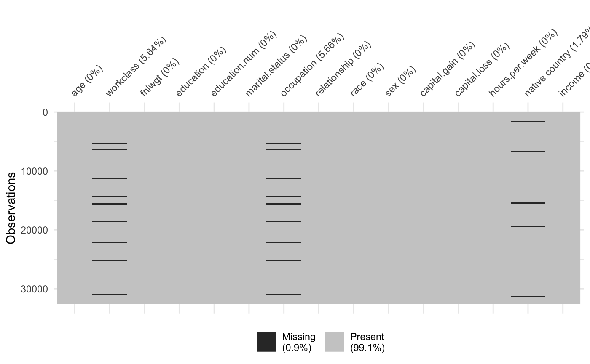

```{r setup, include=FALSE}
knitr::opts_chunk$set(echo = TRUE)
```

## Introduction

With growing inequality in the American society, we are interested in seeing what factors contribute to divergence in individuals’ income level. Understanding these factors is an important first step in working toward a more equitable distribution of income. We will be investigating these factors using data from the 1994 US census bureau database. In this specific case, we are looking to see what factors contribute to one’s income to be greater than \$50k (approximately \$80k in 2021) in 1994.

The data set used contains 32561 observations and 15 variables. The outcome variable is a binary variable, `income`, which represents whether or not a person makes greater than or less than/equal to $50k a year. The predictor variables are: `age`, `fnlwgt`, `education.num`, `capital.gain`, `capital.loss`, `hours.per.week`, `workclass`, `education`, `marital.status`, `occupation`, `relationship`, `race`, `sex`, and `native.country`. The first 6 of these are continuous and the latter 8 are categorical.

Data source: https://www.kaggle.com/uciml/adult-census-income/

## Data Cleaning

Many categorical predictors contained numerous levels (e.g. `native.country` contained 42). This meant that some levels ultimately have very few observations, especially in cases where the distributions were skewed. This poses an issue in data partitioning later on because oftentimes, the observations of a level could be allocated entirely to the training or testing data set. To remedy this issue, the levels of the predictors that contained more than 5 levels were grouped based on logical sense.

For `workclass`, all government jobs were combined into one category, and all self-employed jobs into another.

Similarly, `occupation` was grouped into 6 categories, according to the 2018 US Census Occupation code list. The categories were MBSA (management, business, science and arts), Service, Sales, NCM (Natural
Resources, Construction and Maintenance), PTM (Production, Transportation and Material Moving), and Armed-Forces. 

All levels in `marital.status` that started with “Married” were grouped into one “Married” category and all countries in `native.country` that were not “United-States” into one “Others” category.

As seen from Figure 1, only 0.9% of the data was missing from just three predictors, so the missing observations were dropped. After dropping the missing observations, the "Without-pay" category of `workclass` and "Armed-Forces" category of `occupation` had very few observations and did not logically fit in any of the other categories, thus all observations of those two categories were dropped as well. `fnlwgt`, an estimate derived such that people with similar demographic characteristics have similar weights, was dropped as it was decidedly unrelated to income.


We also experimented with changing the continuous predictors `capital.gain` and `capital.loss` into binary (gain/loss or not) due to an excess of 0's, as well as categorizing `education` and `hours.per.week`. However, none of these transformations improved cross-validation performance, possibly due to the loss of information from categorizing numeric data. Thus we performed a log(1+x) transformation on `capital.gain` and `capital.loss` to attempt to correct for skew, kept `hours.per.week` as is, and did not include `education` (due to its redundancy with `education.num`) in the final data set.

After the cleaning process outlined above, the final data set that we will perform EDA and modeling on contains 30139 observations and 13 variables.



## Exploratory Analysis and Visualization

Among the continuous predictors, we can see that from Figure 2 the age for those with incomes less than 50k per year is skewed younger. The age for those with incomes greater than 50k per year is relatively more normally distributed and the median age is higher than that of the other group. Within capital gain and capital loss, we can see that the values for these two predictors are both heavily skewed towards 0 with a light right-tail for both income groups. Looking at the number of years of education, we can see that for those with incomes greater than 50k, the number of years is skewed higher, with the majority of observations having at least 8 years of education and close to half having more than 12. The education years for people with incomes less than 50k is more normally distributed, with the median being around 8 to 9 years of education, and less observations with over 12 years of education. We can also observe that those with incomes greater than 50k tend to work more hours per week. 

Among the categorical predictors, we can see from Figure 3 that there exists greater discrepancies in martial status, occupation, race, relationship and sex between the two income groups. Those with incomes greater than 50k per year tend to be married, with occupations in the MBSA category, white, male and husband of the household. Though the majority of these people are also native to the US and working in private companies, the ratio between the two income groups is similar for US and other country natives, as well as government, private and self-employed jobs, so a clear trend can't be identified for the `native.country` and `workclass` predictors. 


## Models

### Predictor Variables
For the final models, 13 predictor variables were used in total. The five continuous variables are `age`, `education.num`, `capital.gain`, `capital.loss`, and `hours.per.week`. The nine categorical variables are `workclass`, `marital.status`, `occupation`, `relationship`, `race`, `sex`, and `native.country`.

### Model Selection
All categorical predictors were turned into dummy variables and the data set was split into 70:30 training to test data. The training data with all predictors was then trained on a variety of models with ranging flexibility and assumptions: logistic regression, elastic net, LDA, QDA, MARS, and Random Forest (including bagging and boosting). The cross-validation and test AUC results are shown below:

### Model Assumptions
For models such as logistic regression and discriminant analysis, we assume that the predictor variables to be multivariate normal. These models also require the predictor variables as well as the residuals to not be highly correlated with each other. Furthermore, the variance term should be normally distributed and constant across all values of the predictor variables. While these assumptions are specified, the models listed above can still be quite robust even when they are slightly violated. For instance, LDA can still work for non-normal data by Fisher's argument.

For decision tree based model such as random forest, since no probabilistic model is needed with its use of binary splits, no assumption is needed as long as the sampling is representative. 

### Tuning Parameters

### Limitations
Some predictors were non-normally distributed and heavily skewed, or had highly imbalanced classes. This may have affected the model performances for LDA and QDA, as both models assume the observations to be normally distributed. 


## Conclusions

We found that from the 1994 US Census Dataset, random forest (bagging and boosting) performed the best at classifying income to less than/equal to 50k or above 50k. This result was somewhat expected given that those models are ensemble models that utilized the "wisdom of (weighted) crowds (experts)" to decrease variance and bias as well as improving predictions.

From our models, some predictors for a person making greater/less than $50,000 a year align well with conventional beliefs. For instance, having higher education and advanced degrees is certainly a gateway for higher earnings; younger people who just joined the workforce would have less of a chance of making more than \$50k; the gender wage gap is very apparent with males much likely to earn more; and the type of occupation also correlates with earning levels. In addition, some results such as having higher capital gain OR loss both contribute to higher earnings might seem surprising at first but are in fact reasonable. People with higher earning potentials (higher education etc.) tend to have both the knowledge and ability to pursue passive income from capital investments. While there are volatility in the world of investment which might lead to unexpected gain or loses in one year (1994), having a passive income portfolio still does lead to higher life-time earnings in the long run.

On the other hand, the models also produced a number of results that we were not expecting. For example, staying in a marriage was proven to be the most important predictor of having income greater than \$50k. One potential cause that could explain this relationship is that married couples are sometimes entitled to more favorable tax laws. Another possible explanation could be that people with higher incomes are more likely to find a partner and get married. Although staying in marriage is an important factor, those who have married in the past (divorced/separated/widowed) are also more likely to have more than \$50k income than never-married people. Part of this effect could be attributed to the fact that unmarried individuals are on the younger end (increase age does positively correspond to earnings), but it could also be for other reasons that warrant further investigation.

In conclusion, our analysis through using the 1994 Census Data provides us with many interesting insights to the underlying factors behind income inequalities. Being in a stable marriage turns out to be one of the more important determining factor in predicting one’s income. In addition, at the time this data was gathered, there did exist a sizable gender gap in terms of income. Furthermore, people who have the ability and awareness to participate in investment, even when return is negative, tend to be more likely to earn more money. However, due to the low number of observations from non-white races or non-native immigrants, our analysis does not provide adequate information for the role that race and immigrant status play in determining income levels. 
